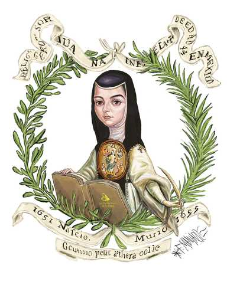

```{python}
#| echo: false
from datetime import datetime
import json
import unicodedata

import numpy as np
import pandas as pd
import plotly.express as px
import plotly.graph_objects as go

def normalizar_estado(valor):
    texto = str(valor).strip().upper()
    texto = "".join(
        caracter
        for caracter in unicodedata.normalize("NFKD", texto)
        if not unicodedata.combining(caracter)
    )
    reemplazos = {
        "VERACRUZ DE IGNACIO DE LA LLAVE": "VERACRUZ",
        "COAHUILA DE ZARAGOZA": "COAHUILA",
        "MICHOACAN DE OCAMPO": "MICHOACAN",
        "CIUDAD DE MEXICO": "CIUDAD DE MEXICO",
        "DISTRITO FEDERAL": "DISTRITO FEDERAL",
        "MEXICO": "ESTADO DE MEXICO",
    }
    return reemplazos.get(" ".join(texto.split()), " ".join(texto.split()))


def recuperar_pobreza(valor):
    if pd.isna(valor):
        return np.nan
    if isinstance(valor, datetime):
        return float(f"{valor.day}.{valor.month}")
    return float(valor)
```

::: {.dashboard-shell}

::: {.screen .screen-cover}

::: {.screen-banner .text-center}
El conocimiento como escape en México
:::

::: {.screen-hero .text-center}
¿ QUÉ HUBIERA PASADO SI SOR JUENA INÉS DE LA CRUZ HUBIERA NACIDO EN EL MÉXICO ACTUAL?
:::

::: {.screen-card .text-center}


### HACE AÑOS EN LA NUEVA ESPAÑA

"Sor Juana nació en un mundo donde la educación no era un derecho, hoy siglos después".... **¿Realmente es diferente?**

Sor Juana Inés de la Cruz no tenía acceso a educación formal, pero insistió. Por que incluso sin datos, ya sabía algo que ho sí podemos demostrar: Sin educación, las oportunidades no existen.
:::

::: {.screen-card .ods-strip .text-center}

:::

:::

::: {.screen}

::: {.screen-title}
Su amor por las letras se dió “Desde que le rayó la primera luz de la razón”
:::

::: {.screen-card}
Juana Ramírez de Asbaje nació el 12 de Noviembre de 1651(o de 1648) En nuevo México. Durante su vida, su amor por las letras se dio desde tempranísima edad pues a los tres años, tomó lecciones y aprendió a leer.
:::

:::: {.columns}

::: {.column width="100%"}
::: {.screen-card}
> En México existen personas que no saben leer ni escribir, incluso en edades adultas debido a que diversos aspectos sociales dificultan el acceso a la educación.

```{python}
#| echo: false
df = pd.read_excel("data/analfabetismo.xlsx", sheet_name="Tabulado", header=5)
df.columns = [str(columna).strip() for columna in df.columns]
df = df.rename(columns={"Entidad federativa": "estado", "Porcentaje": "porcentaje"})

with open("data/mexico_estados.geojson", encoding="utf-8") as archivo:
    geojson = json.load(archivo)

for feature in geojson["features"]:
    feature["id"] = normalizar_estado(feature["properties"]["ENTIDAD"])

estados_geojson = {feature["id"] for feature in geojson["features"]}

df = df.loc[df["estado"].notna(), ["estado", "porcentaje"]].copy()
df["estado_normalizado"] = df["estado"].map(normalizar_estado)
df.loc[
    df["estado_normalizado"] == "QUERETARO", "estado_normalizado"
] = "QUERETARO DE ARTEAGA"
df = df[df["estado_normalizado"].isin(estados_geojson)].copy()
df["porcentaje"] = df["porcentaje"] * 100

fig = px.choropleth(
    df,
    geojson=geojson,
    locations="estado_normalizado",
    featureidkey="id",
    color="porcentaje",
    hover_name="estado",
    color_continuous_scale=[
        [0.0, "#f3d8cf"],
        [0.35, "#d88aa0"],
        [0.7, "#8a1e56"],
        [1.0, "#2b0017"],
    ],
    labels={"porcentaje": "% de analfabetismo"},
)

fig.update_traces(
    marker_line_color="#0a0a0a",
    marker_line_width=1.8,
    hovertemplate="<b>%{hovertext}</b><br>Analfabetismo: %{z:.2f}%<extra></extra>",
)

fig.update_layout(
    title=dict(
        text="Indice de analfabetismo por estado en Mexico",
        x=0.5,
        xanchor="center",
        font=dict(size=18, color="#1f1a17"),
    ),
    autosize=True,
    height=640,
    margin=dict(l=10, r=10, t=60, b=80),
    paper_bgcolor="rgba(0,0,0,0)",
    plot_bgcolor="rgba(0,0,0,0)",
    coloraxis_colorbar=dict(
        title="% de analfabetismo",
        orientation="h",
        ticksuffix="%",
        thickness=14,
        len=0.72,
        x=0.5,
        xanchor="center",
        y=0.02,
        outlinewidth=0,
    ),
    geo=dict(
        fitbounds="locations",
        visible=False,
        bgcolor="rgba(0,0,0,0)",
        domain=dict(x=[0.0, 1.0], y=[0.12, 0.98]),
    ),
)

fig
```
:::
:::

::::

::: {.screen-note .text-center}
**Aunque hoy hemos avanzado, la desigualdad en educación sigue existiendo.**
:::

:::

::: {.screen}

::: {.screen-title}
Con corta edad aprendió a leer, escribir y contar, y aún siendo una niña, consiguió dominar el latín en sólo 20 lecciones y escribió su primer poema: “Loa al Santísimo Sacramento”.
:::

::: {.screen-card}
```{python}
#| echo: false
idiomas_raw = pd.read_excel("data/idiomas.xlsx", sheet_name="Hoja1", header=None)
idiomas_raw = idiomas_raw.iloc[4:35, :10].copy()
idiomas_raw.columns = [
    "estado",
    "frances_hombres",
    "frances_mujeres",
    "frances_total",
    "ingles_hombres",
    "ingles_mujeres",
    "ingles_total",
    "italiano_hombres",
    "italiano_mujeres",
    "italiano_total",
]

for columna in idiomas_raw.columns[1:]:
    idiomas_raw[columna] = pd.to_numeric(
        idiomas_raw[columna].replace("-", 0), errors="coerce"
    ).fillna(0)

configuracion_idiomas = [
    ("Ingles", "Inglés", "ingles_total"),
    ("Frances", "Francés", "frances_total"),
    ("Italiano", "Italiano", "italiano_total"),
]

fig = go.Figure()
botones = []

for indice, (_, etiqueta, total_col) in enumerate(configuracion_idiomas):
    datos = idiomas_raw[["estado", total_col]].copy()
    datos.columns = ["estado", "total"]
    datos = datos.sort_values("total", ascending=False)
    visible = indice == 0

    fig.add_trace(
        go.Bar(
            x=datos["estado"],
            y=datos["total"],
            name="Total",
            visible=visible,
            marker=dict(color="#8a1e56"),
            hovertemplate="<b>%{x}</b><br>Total: %{y:.0f}<extra></extra>",
        )
    )

    visibilidad = [False] * len(configuracion_idiomas)
    visibilidad[indice] = True

    botones.append(
        dict(
            label=etiqueta.upper(),
            method="update",
            args=[
                {"visible": visibilidad},
                {
                    "title.text": f"Personas que hablaban {etiqueta.lower()} por entidad",
                    "xaxis.categoryorder": "array",
                    "xaxis.categoryarray": datos["estado"].tolist(),
                },
            ],
        )
    )

fig.update_layout(
    title=dict(
        text="Personas que hablaban inglés por entidad",
        x=0.5,
        xanchor="center",
        font=dict(size=22, color="#1f1a17"),
    ),
    autosize=True,
    height=620,
    margin=dict(l=30, r=20, t=90, b=60),
    paper_bgcolor="rgba(0,0,0,0)",
    plot_bgcolor="#fcfbf8",
    xaxis=dict(
        title="Estado",
        categoryorder="array",
        categoryarray=idiomas_raw.sort_values("ingles_total", ascending=False)["estado"].tolist(),
        gridcolor="rgba(89, 57, 70, 0.12)",
        zeroline=False,
        tickangle=-45,
    ),
    yaxis=dict(
        title="Total de personas",
        gridcolor="rgba(89, 57, 70, 0.12)",
        zeroline=False,
    ),
    updatemenus=[
        dict(
            type="buttons",
            direction="right",
            x=0.5,
            xanchor="center",
            y=1.10,
            yanchor="top",
            showactive=True,
            bgcolor="#c98aa5",
            bordercolor="#c98aa5",
            font=dict(color="#fffaf6", size=14),
            pad=dict(t=0, r=8, b=0, l=8),
            buttons=botones,
        )
    ],
)

fig
```

En México, la lengua materna es el español. Sin embargo, el dominio de otros idiomas tales como el inglés, francés, italiano, entre otros, se ha vuelto una habilidad determinante en la adquisición de un empleo bien remunerado. Sin embargo, el porcentaje de la población que domina un idioma extranjero es mínimo en la actualidad.
:::

:::

::: {.screen}

::: {.screen-title}
Se armó de constancia y disciplina, a tal grado que, niña aún, se abstuvo de comer queso, puesto que había oído “que entontecía a las personas”
:::

:::: {.columns}

::: {.column width="30%"}
::: {.screen-card}

> En México, un gran porcentaje de la población no deja de comer cosas por disciplina o mejoras en sus aprendizajes.

> Muchas personas no pueden elegir que comer porque viven en condiciones de pobreza que limita sus dietas, salud y educación.

> Diversas familias en México no pueden satisfacer sus necesidades básicas debido a la pobreza.
:::
:::

::: {.column width="70%"}
::: {.screen-card}
```{python}
#| echo: false
pobreza_raw = pd.read_excel("data/Hogares_15.xlsx", sheet_name="Tabulado", header=[6, 7])
pobreza_raw.columns = [
    "estado",
    "2016_total",
    "2016_moderada",
    "2016_extrema",
    "2018_total",
    "2018_moderada",
    "2018_extrema",
    "2020_total",
    "2020_moderada",
    "2020_extrema",
    "2022_total",
    "2022_moderada",
    "2022_extrema",
    "2024_total",
    "2024_moderada",
    "2024_extrema",
]

pobreza = pobreza_raw.iloc[1:].copy()
pobreza = pobreza[pobreza["estado"].notna()].copy()
pobreza = pobreza[pobreza["estado"] != "Estados Unidos Mexicanos"].copy()

columnas_extrema = [
    "2016_extrema",
    "2018_extrema",
    "2020_extrema",
    "2022_extrema",
    "2024_extrema",
]

for columna in columnas_extrema:
    pobreza[columna] = pd.to_numeric(pobreza[columna], errors="coerce")

top_10_estados = pobreza.nlargest(10, "2024_extrema")["estado"].tolist()
pobreza_top = pobreza[pobreza["estado"].isin(top_10_estados)].copy()

pobreza_larga = pobreza_top.melt(
    id_vars="estado",
    value_vars=columnas_extrema,
    var_name="periodo",
    value_name="personas_pobreza",
)
pobreza_larga["anio"] = pobreza_larga["periodo"].str.extract(r"(\d{4})").astype(int)
orden_estados = pobreza_top.sort_values("2024_extrema", ascending=False)["estado"].tolist()

fig = px.line(
    pobreza_larga,
    x="anio",
    y="personas_pobreza",
    color="estado",
    markers=True,
    category_orders={"estado": orden_estados},
    color_discrete_sequence=[
        "#2b0017", "#8a1e56", "#b44779", "#d16b95", "#7a3656",
        "#4b6a88", "#3f8f8c", "#8b5e3c", "#5b4b8a", "#d88aa0",
    ],
    labels={"anio": "Año", "personas_pobreza": "Miles de personas", "estado": "Estado"},
)

fig.update_traces(
    line=dict(width=2.4),
    marker=dict(size=7, line=dict(width=1.2, color="#fcfbf8")),
    hovertemplate="<b>%{fullData.name}</b><br>Año: %{x}<br>Pobreza extrema: %{y:,.0f} miles<extra></extra>",
)

fig.update_layout(
    title=dict(
        text="Evolución de la población en pobreza extrema en los 10 estados más afectados",
        x=0.5,
        xanchor="center",
        y=0.97,
        font=dict(size=18, color="#1f1a17"),
    ),
    autosize=True,
    height=620,
    margin=dict(l=30, r=20, t=115, b=120),
    paper_bgcolor="rgba(0,0,0,0)",
    plot_bgcolor="#fcfbf8",
    legend=dict(
        title="Estado",
        orientation="h",
        x=0.5,
        xanchor="center",
        y=-0.22,
        yanchor="top",
    ),
    xaxis=dict(
        tickmode="array",
        tickvals=[2016, 2018, 2020, 2022, 2024],
        gridcolor="rgba(89, 57, 70, 0.10)",
        zeroline=False,
    ),
    yaxis=dict(
        title="Miles de personas",
        gridcolor="rgba(89, 57, 70, 0.12)",
        zeroline=False,
    ),
)

fig
```
:::
:::

::::

:::

::: {.screen}

::: {.screen-title}
Pero había un límite claro: ser mujer en el siglo XVII significaba no tener acceso formal a la educación.
:::

:::: {.columns}

::: {.column width="40%"}
::: {.screen-card}
A pesar de su increíble ambición de conocimiento y predisposición de aprender, Sor Juana nos muestra una lección clara: El talento nace en cualquier lugar. La condiciones oportunas no.

> En México, existe talento en cada rincón. Sin embargo, muchas personas no logran desarrollar sus talentos, debido a limitantes económicas, académicas y sociales del lugar donde nacen.

Los datos indican algo muy contundente:

**“La pobreza sigue concentrándose donde hay menos educación”**
:::
:::

::: {.column width="60%"}
::: {.screen-card}
```{python}
#| echo: false
educacion_raw = pd.read_excel("data/Educacion_04.xlsx", sheet_name="Tabulado", header=5)
educacion = educacion_raw.rename(
    columns={"Entidad federativa": "estado", "PORCENTAJE UNIVERSIDAD": "educacion"}
)
educacion = educacion[educacion["estado"].notna()].copy()
educacion = educacion[educacion["estado"] != "Estados Unidos Mexicanos"].copy()
educacion["educacion"] = pd.to_numeric(educacion["educacion"], errors="coerce") * 100
educacion["estado_key"] = educacion["estado"].map(normalizar_estado)

pobreza_raw = pd.read_excel("data/pobreza (1).xlsx", sheet_name="Hoja 1", header=0)
pobreza = pobreza_raw.rename(
    columns={"Entidad": "estado", "Porcentaje de la población en situación de pobreza": "pobreza"}
)
pobreza = pobreza[pobreza["estado"].notna()].copy()
pobreza = pobreza[pobreza["estado"] != "Estados Unidos Mexicanos"].copy()
pobreza["pobreza"] = pobreza["pobreza"].map(recuperar_pobreza)
pobreza["estado_key"] = pobreza["estado"].map(normalizar_estado)

df = educacion.merge(pobreza[["estado_key", "pobreza"]], on="estado_key", how="inner")
df = df.dropna(subset=["educacion", "pobreza"]).copy()

pendiente, intercepto = np.polyfit(df["educacion"], df["pobreza"], 1)
x_linea = np.linspace(df["educacion"].min(), df["educacion"].max(), 100)
y_linea = pendiente * x_linea + intercepto

fig = go.Figure()
fig.add_trace(
    go.Scatter(
        x=df["educacion"],
        y=df["pobreza"],
        mode="markers",
        customdata=df[["estado"]],
        marker=dict(size=11, color="#9b3f67", opacity=0.82, line=dict(color="#f5e9e2", width=1.3)),
        hovertemplate="<b>%{customdata[0]}</b><br>Porcentaje universidad: %{x:.1f}%<br>Pobreza: %{y:.1f}%<extra></extra>",
        showlegend=False,
    )
)
fig.add_trace(
    go.Scatter(
        x=x_linea,
        y=y_linea,
        mode="lines",
        line=dict(color="#2b211f", width=2.4),
        hoverinfo="skip",
        showlegend=False,
    )
)
fig.update_layout(
    title=dict(text="Relación entre educación y pobreza por estado", x=0.5, xanchor="center", font=dict(size=18, color="#1f1a17")),
    autosize=True,
    height=620,
    margin=dict(l=30, r=20, t=70, b=50),
    paper_bgcolor="rgba(0,0,0,0)",
    plot_bgcolor="#fcfbf8",
    xaxis=dict(title="Porcentaje universidad (%)", gridcolor="rgba(89, 57, 70, 0.12)", zeroline=False),
    yaxis=dict(title="Población en situación de pobreza (%)", gridcolor="rgba(89, 57, 70, 0.12)", zeroline=False),
)
fig
```
:::
:::

::::

:::

::: {.screen}

::: {.screen-title}
Sor Juana trabajaba. Convirtió el conocimiento en valor a través de sus mecenas, quienes fueron principalmente virreinas de la Nueva España que financiaron y promovieron la obra de la poetisa.
:::

:::: {.columns}

::: {.column width="60%"}
::: {.screen-card}
```{python}
#| echo: false
salarios = pd.read_excel("data/salarios.xlsx", sheet_name="Hoja1", header=0)
salarios = salarios.rename(columns={"Entidad": "estado", "Ingreso promedio mensual": "salario"})
salarios = salarios[salarios["estado"].notna()].copy()
salarios["salario"] = pd.to_numeric(salarios["salario"], errors="coerce")
salarios["estado_key"] = salarios["estado"].map(normalizar_estado)

df = educacion.merge(salarios[["estado_key", "salario"]], on="estado_key", how="inner")
df = df.dropna(subset=["educacion", "salario"]).copy()

pendiente, intercepto = np.polyfit(df["educacion"], df["salario"], 1)
x_linea = np.linspace(df["educacion"].min(), df["educacion"].max(), 100)
y_linea = pendiente * x_linea + intercepto

fig = go.Figure()
fig.add_trace(
    go.Scatter(
        x=df["educacion"],
        y=df["salario"],
        mode="markers",
        customdata=df[["estado"]],
        marker=dict(size=11, color="#9b3f67", opacity=0.82, line=dict(color="#f5e9e2", width=1.3)),
        hovertemplate="<b>%{customdata[0]}</b><br>Porcentaje universidad: %{x:.1f}%<br>Salario promedio: $%{y:,.0f}<extra></extra>",
        showlegend=False,
    )
)
fig.add_trace(
    go.Scatter(
        x=x_linea,
        y=y_linea,
        mode="lines",
        line=dict(color="#2b211f", width=2.4),
        hoverinfo="skip",
        showlegend=False,
    )
)
fig.update_layout(
    title=dict(text="Relación entre educación y salario por estado", x=0.5, xanchor="center", font=dict(size=18, color="#1f1a17")),
    autosize=True,
    height=620,
    margin=dict(l=30, r=20, t=70, b=50),
    paper_bgcolor="rgba(0,0,0,0)",
    plot_bgcolor="#fcfbf8",
    xaxis=dict(title="Porcentaje universidad (%)", gridcolor="rgba(89, 57, 70, 0.12)", zeroline=False),
    yaxis=dict(title="Ingreso promedio mensual", gridcolor="rgba(89, 57, 70, 0.12)", zeroline=False, tickprefix="$", separatethousands=True),
)
fig
```
:::
:::

::: {.column width="40%"}
::: {.screen-card}
Sus mecenas le brindaron respaldo a Sor Juana, lo que le permitió continuar con sus estudios y labor literaria a pesar de las limitaciones de la época.

> Así como Sor Juana utilizó el conocimiento para acceder a mejores condiciones de vida, hoy los datos muestran que en México, la educación sigue siendo el principal factor para mejorar el ingreso.
:::
:::

::::

:::

::: {.screen}

::: {.screen-title}
Sin embargo, su protección no fue solo económica, sino que facilitó la publicación de sus obras en España, permitiéndole ser una de las pocas voces femeninas reconocidas en Europa durante esa época. Sor Juana se sentía respaldada ejerciendo su labor.
:::

::: {.screen-card}
> Más educación no solo aumenta el salario, también mejora la calidad del empleo. El ODS 8 busca que el talento no dependa del privilegio, sino que siempre encuentre un trabajo digno. Actualmente, en México hay muchas personas que siguen trabajando sin condiciones dignas.
:::

::: {.screen-card}
```{python}
#| echo: false
seguro = pd.read_excel("data/Seguro.xlsx", sheet_name="Tabulado", header=5)
seguro = seguro.rename(columns={"Entidad federativa": "estado", "Porcentaje con servicios": "porcentaje_seguro"})
seguro = seguro[seguro["estado"].notna()].copy()
seguro = seguro[seguro["estado"] != "Estados Unidos Mexicanos"].copy()
seguro["porcentaje_seguro"] = pd.to_numeric(seguro["porcentaje_seguro"], errors="coerce") * 100
seguro = seguro[seguro["porcentaje_seguro"].notna()].copy()
seguro = seguro.sort_values("porcentaje_seguro", ascending=False)

fig = go.Figure(
    data=[
        go.Bar(
            x=seguro["estado"],
            y=seguro["porcentaje_seguro"],
            marker=dict(color="#8a1e56", line=dict(color="#5c1237", width=1.1)),
            hovertemplate="<b>%{x}</b><br>Población con seguro social: %{y:.1f}%<extra></extra>",
        )
    ]
)
fig.update_layout(
    title=dict(text="Porcentaje de población con seguro social por estado", x=0.5, xanchor="center", font=dict(size=18, color="#1f1a17")),
    autosize=True,
    height=620,
    margin=dict(l=40, r=30, t=80, b=160),
    bargap=0.16,
    paper_bgcolor="rgba(0,0,0,0)",
    plot_bgcolor="#fcfbf8",
    xaxis=dict(
        title="Estados de México",
        categoryorder="array",
        categoryarray=seguro["estado"].tolist(),
        tickangle=-50,
        automargin=True,
        gridcolor="rgba(89, 57, 70, 0.10)",
        zeroline=False,
    ),
    yaxis=dict(
        title="Porcentaje de población con seguro social",
        ticksuffix="%",
        range=[50, 90],
        gridcolor="rgba(89, 57, 70, 0.12)",
        zeroline=False,
    ),
)
fig
```
:::

:::

::: {.screen .screen-end}

:::: {.columns .end-columns}

::: {.column width="74%"}
::: { .screen-end-panel .text-center}
Gracias a su inteligencia y su incansable búsqueda de oportunidades para desarrollar su talento, Sor Juana Inés de la Cruz logró escribir su obra literaria, considerada por los críticos literarios como una de las más importantes de los Siglos de Oro, a la altura de poetas y dramaturgos como Miguel de Cervantes. Sor Juana Inés de la Cruz convirtió el conocimiento en valor. Su inteligencia la llevó a espacios donde otros no podían entrar. Hoy, ese mismo principio sigue vigente: La educación abre la puerta al trabajo digno.
:::
:::

::: {.column width="26%"}
::: {.screen-card .screen-end-figure .text-center}

:::
:::

::::

:::

:::
